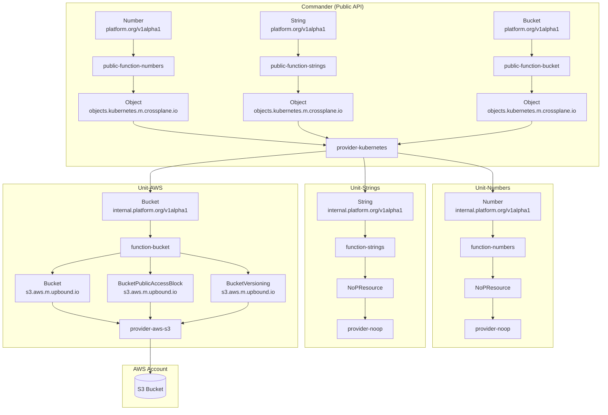

# Fleet Commander Demo

This is a demonstrator, with public available data and components only, of the conference talk [BREAK THE SILO: How we built a decentralized control plan for service orchestration](https://github.com/juliusbaer/conferences/blob/main/2026/voxxed-days-zurich/Fleet%20Commander%20-%20Voxxed%20Days%20Zurich%202026.pdf)

[Voxxed Days Zurich 2026 Recording](https://www.youtube.com/watch?v=u5eAaJuZa3o)

## Concept

The concept of the demo is simple:
1. apply a custom resource on the commander (Public API)
2. the public composition function will decompose it in a provider-kubernetes `Object` that wraps the internal custom resource
3. provider-kubernetes applies the custom resources on the Unit cluster
4. the internal composition decomposes it on the final object: for simplicity, a provider-nop `NopResource`

In a productive setup, provider-nop is replaced by providers managing real resources.

An example is the `unit-aws` (disabled by default in the demo).



## Requirements
- [mise](https://mise.jdx.dev/) — tool version manager and task runner

All other tools (kind, kubectl, crossplane CLI, Go) are managed by mise and installed automatically.

### Development Requirements
- [Docker](https://www.docker.com/) with [buildx](https://github.com/docker/buildx) support
- A container registry account with push access (e.g. ghcr.io) or a [local registry](https://hub.docker.com/_/registry)

## Run the demo locally

**IMPORTANT**: check the `Troubleshooting` section at the end in case of issues when bringing up the KinD clusters.

```sh
mise all:setup
mise all:deploy
```

Once the commander and the units are deployed, deploy a test custom resource with:

```sh
mise numbers:create
mise strings:create
```

and use `kubectl` to verify the state.

```sh
# cleanup the examples
mise numbers:delete
mise strings:delete
```

### Use custom registry

`imagePullSecrets` and `packagePullSecrets` should be manually configured on the clusters.

## Clean up

```sh
mise all:teardown
```

## How to build

Function images are pushed to an OCI registry and pulled by Crossplane inside each KinD cluster.
The registry is configurable so the project can be forked without code changes.

`docker login` is required before starting.

### Create a local config file

Copy the example and fill in your values:

```sh
cp mise.local.toml.example mise.local.toml
```

`mise.local.toml` is gitignored and never committed.

Configure the `BUILD_` variables according to your setup.

| Variable         | Description                                            | Example         |
|------------------|--------------------------------------------------------|-----------------|
| `BUILD_REGISTRY` | Registry prefix including namespace, no trailing slash | `ghcr.io/erost` |
| `BUILD_VERSION`  | Valid Semver format                                    | `0.0.1`         |

### Build compositions

Check the `[tasks."composition:build"]` and `[tasks."composition:build:all"]` for details.

New compositions can be added as long as they follow the correct convention.

```
commander/public-function-<name>/             # the implementation of the public composition
commander/public-function-<name>/chart        # the chart to deploy the composition
units/unit-<purpose>/function-<name>/         # the implementation of the internal composition
units/unit-<purpose>/function-<name>/chart    # the chart to deploy the internal composition
```

Once built, the new composition can be configured in `deployment.yaml`.

### Other resources

```
.scripts                          # build and deploy scripts
.scripts/kind                     # kind cluster configurations
common/deployment/*.yaml          # additional deployment configuration (e.g.: providers)
common/generic-composition-chart  # a library chart used as the base for all compositions
deployment.yaml                   # simplified deployment descriptor for all components
```

## AWS Setup (unit-aws)

**IMPORTANT**: this is disabled by default.

`unit-aws` uses [provider-aws-s3 v0.58.0](https://marketplace.upbound.io/providers/upbound/provider-aws-s3/v2.5.0) to manage real S3 resources. Each namespace on `unit-aws` carries its own `ProviderConfig` named `aws`, so different namespaces can point to different AWS accounts.

### Step 1 — Create a minimally-scoped IAM user

In the AWS Console (or via CLI), create an IAM user with **programmatic access only** and attach the following inline policy. It grants exactly what provider-aws-s3 needs to manage a bucket, its public-access block, versioning, and lifecycle configuration — nothing more.

```json
{
  "Version": "2012-10-17",
  "Statement": [
    {
      "Sid": "S3BucketManagement",
      "Effect": "Allow",
      "Action": [
        "s3:GetBucketPublicAccessBlock",
        "s3:GetLifecycleConfiguration",
        "s3:GetBucketTagging",
        "s3:PutBucketPublicAccessBlock",
        "s3:GetBucketWebsite",
        "s3:GetBucketLogging",
        "s3:CreateBucket",
        "s3:ListBucket",
        "s3:GetAccelerateConfiguration",
        "s3:GetBucketVersioning",
        "s3:GetBucketAcl",
        "s3:GetBucketPolicy",
        "s3:GetReplicationConfiguration",
        "s3:GetBucketObjectLockConfiguration",
        "s3:GetEncryptionConfiguration",
        "s3:PutBucketTagging",
        "s3:GetBucketRequestPayment",
        "s3:GetBucketCORS",
        "s3:PutBucketPolicy",
        "s3:DeleteBucket",
        "s3:PutBucketVersioning"
	  ],
      "Resource": "*"
    }
  ]
}
```

> `Resource: "*"` is intentional — S3 bucket ARNs are not known at policy-creation time. To lock it down further, replace `"*"` with `"arn:aws:s3:::your-prefix-*"`.

Generate an **Access Key ID** and **Secret Access Key** for this user. Do not save the credentials file — enter them directly into the setup script in the next step.

### Step 2 — Configure credentials on unit-aws

```sh
mise aws:setup-credentials
```

The script prompts for:
- **Target namespace** (default: `default`) — the namespace on `unit-aws` where Buckets will be created
- **AWS Access Key ID**
- **AWS Secret Access Key** (input is hidden, never echoed)
- **AWS Default Region** (default: `eu-west-1`)

Credentials flow only through shell variables piped directly into `kubectl`. Nothing is written to disk. The script is idempotent — safe to re-run to rotate credentials.

Repeat for each namespace that needs a different AWS account.

### Step 3 — Create a Bucket

Apply a `Bucket` resource to the **commander** cluster in the same namespace you configured:

```yaml
apiVersion: platform.org/v1alpha1
kind: Bucket
metadata:
  name: my-demo-bucket
  namespace: default
spec:
  bucketName: my-globally-unique-bucket-name
  region: eu-west-1
```

This provisions via `unit-aws` a S3 Bucket with:
- Public access blocked
- Versioning enabled

## Troubleshooting

### Too many open files

Running multiple `kind` clusters may result in issues with too many open files.

Example:

```sh
❯ kubectl --context=kind-commander -n kube-system logs -l k8s-app=kube-proxy
E0319 21:27:41.893683       1 run.go:72] "command failed" err="failed complete: too many open files"
```

To avoid that, run:

```sh
sysctl -w fs.inotify.max_user_instances=1280
sysctl -w fs.inotify.max_user_watches=655360
```

#### Colima configuration

Using colima, add the following entry to `colima.yaml`:

```yaml
provision:
  - mode: system
    script: |
      sysctl -w fs.inotify.max_user_instances=1280
      sysctl -w fs.inotify.max_user_watches=655360
```

Using another docker runtime may require a different solution.
